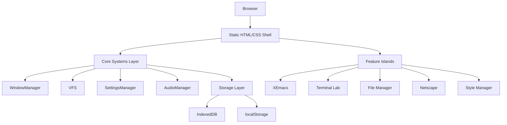
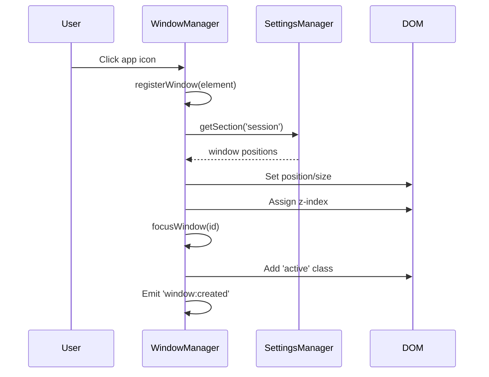
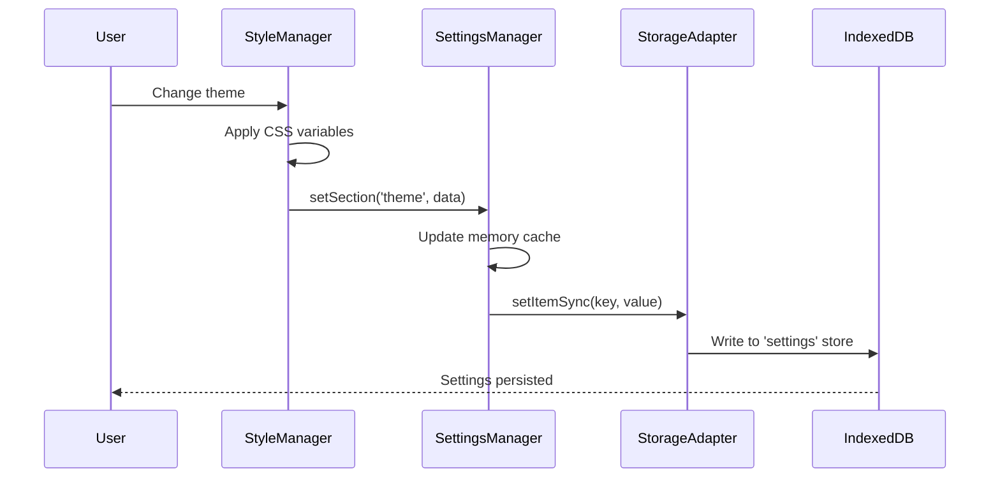
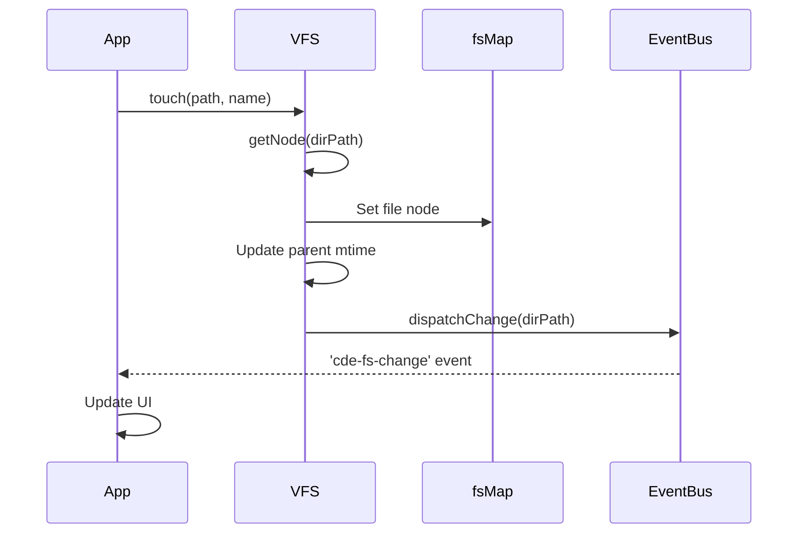

# Architecture Overview

Time Capsule is a Progressive Web App that recreates the 1990s Unix CDE (Common Desktop Environment) desktop experience. The architecture follows a modular, event-driven design pattern built on modern web technologies.

## System Design

The application follows a layered architecture with clear separation of concerns:



## Core Principles

### 1. Modular Architecture

Each core system is implemented as an independent module with a well-defined interface. This promotes code reusability and maintainability.

<CodeGroup>
```typescript Core Module Structure
// src/scripts/core/config.ts
export interface Config {
  WINDOW: WindowConfig;
  AUDIO: AudioConfig;
  FS: FSConfig;
  TERMINAL: TerminalConfig;
  // ... more configuration sections
}

export const CONFIG: Config = {
  WINDOW: {
    MIN_VISIBLE: 20,
    BASE_Z_INDEX: 10000,
    TOP_BAR_HEIGHT: 30,
  },
  AUDIO: {
    BEEP_FREQUENCY: 880,
    BEEP_GAIN: 0.9,
    BEEP_DURATION: 0.1,
  },
  // ... configuration values
};
```
</CodeGroup>

### 2. Event-Driven Communication

Components communicate through custom events dispatched on the window object, promoting loose coupling:

<CodeGroup>
```typescript Event Dispatch
// Notify system of filesystem changes
function dispatchChange(path: string): void {
  window.dispatchEvent(
    new CustomEvent('cde-fs-change', {
      detail: { path },
    })
  );
}
```

```typescript Event Listener
// Listen for filesystem changes
window.addEventListener('cde-fs-change', (event) => {
  const { path } = event.detail;
  // Update UI accordingly
});
```
</CodeGroup>

### 3. Singleton Pattern for Core Systems

Core systems use the singleton pattern to ensure single instances throughout the application lifecycle:

<CodeGroup>
```typescript SettingsManager Singleton
class SettingsManager {
  private static instance: SettingsManager;
  private settings: SystemSettings;

  private constructor() {
    this.settings = this.getDefaultSettings();
    this.load();
  }

  public static getInstance(): SettingsManager {
    if (!SettingsManager.instance) {
      SettingsManager.instance = new SettingsManager();
    }
    return SettingsManager.instance;
  }
}

export const settingsManager = SettingsManager.getInstance();
```
</CodeGroup>

### 4. Progressive Enhancement

The application provides a functional experience even with limited JavaScript, with enhanced features loading progressively.

## Core Components

### WindowManager

Handles all window lifecycle operations including creation, positioning, focus management, and z-index ordering.

**Key Responsibilities:**
- Window registration and lifecycle management
- Drag and drop functionality
- Z-index management (base: 10000 for windows, 90000 for modals)
- Focus management with click and point-to-focus modes
- Window state persistence (position, maximized state)
- Workspace management (4 virtual desktops)
- Mobile-specific centering and constraints

<Tip>
See [Window Manager](/technical/window-manager) for detailed documentation.
</Tip>

### Virtual Filesystem (VFS)

Provides a POSIX-like filesystem abstraction in browser memory with O(1) path lookups.

**Key Features:**
- Hierarchical folder structure
- File metadata (size, mtime, owner, permissions)
- CRUD operations (touch, mkdir, rm, rename, move, copy)
- Trash functionality
- Search with recursive option
- Event notifications on changes

<Tip>
See [Virtual Filesystem](/technical/virtual-filesystem) for detailed documentation.
</Tip>

### SettingsManager

Centralized configuration management with persistent storage.

**Features:**
- Unified settings storage
- Version-aware cache management
- Migration from legacy localStorage keys
- Section-based organization (theme, mouse, keyboard, beep, session, desktop)
- Window session persistence

<Tip>
See [Storage Management](/technical/storage) for detailed documentation.
</Tip>

### AudioManager

Retro audio system using Web Audio API for classic CDE system sounds.

**Capabilities:**
- Lazy AudioContext initialization (on first user gesture)
- System beeps with configurable frequency/duration
- UI feedback sounds (click, error, success)
- Window operation sounds (open, close, minimize, maximize, shade)
- Melody playback for startup chimes
- Volume control

<CodeGroup>
```typescript AudioManager Interface
export interface IAudioManager {
  beep(frequency?: number, duration?: number): void;
  click(): void;
  error(): void;
  success(): void;
  windowOpen(): void;
  windowClose(): void;
  windowMinimize(): void;
  windowMaximize(): void;
  windowShade(): void;
  menuOpen(): void;
  menuClose(): void;
  notification(): void;
  setVolume(volume: number): void;
  playMelody(notes: Array<{
    freq: number;
    duration: number;
    type?: OscillatorType;
    delay?: number
  }>): Promise<void>;
  playStartupChime(): void;
}
```
</CodeGroup>

### StyleManager

Orchestrates multiple style modules for system customization.

**Modules:**
- **ThemeModule**: Color palette management (CDE palettes)
- **FontModule**: Font family and sizing controls
- **MouseModule**: Cursor settings and acceleration
- **KeyboardModule**: Keyboard repeat and shortcuts
- **BeepModule**: Audio feedback settings
- **BackdropModule**: Wallpaper/backdrop management with XPM parsing
- **WindowModule**: Window behavior (focus mode, opaque dragging)
- **ScreenModule**: Screen settings
- **StartupModule**: Boot sequence customization

<CodeGroup>
```typescript StyleManager Structure
export class StyleManager {
  public theme: ThemeModule;
  public font: FontModule;
  public mouse: MouseModule;
  public keyboard: KeyboardModule;
  public beep: BeepModule;
  public backdrop: BackdropModule;
  public windowBehavior: WindowModule;
  public screen: ScreenModule;
  public startup: StartupModule;

  public init(): void {
    const themeSettings = settingsManager.getSection('theme');
    
    // Apply default palette if none saved
    if (!themeSettings.colors || 
        Object.keys(themeSettings.colors).length === 0) {
      this.theme.applyCdePalette('latesummer');
    } else {
      this.theme.loadSavedColors(themeSettings.colors);
    }
    
    // Initialize all modules
    this.mouse.load();
    this.keyboard.load();
    this.beep.load();
    this.backdrop.load();
    // ...
  }
}
```
</CodeGroup>

## Configuration System

Centralized configuration in `config.ts` provides type-safe access to all system constants:

<CodeGroup>
```typescript Configuration Interfaces
export interface WindowConfig {
  MIN_VISIBLE: number;
  BASE_Z_INDEX: number;
  TOP_BAR_HEIGHT: number;
}

export interface FSConfig {
  HOME: string;
  DESKTOP: string;
  TRASH: string;
  NETWORK: string;
}

export interface TerminalConfig {
  HOME_PATH: string;
  MIN_TYPING_DELAY: number;
  MAX_TYPING_DELAY: number;
  POST_COMMAND_DELAY: number;
  POST_SEQUENCE_DELAY: number;
  MAX_LINES: number;
  CLEANUP_INTERVAL: number;
}
```

```typescript Usage Example
import { CONFIG } from './config';

// Access configuration values
const zIndex = CONFIG.WINDOW.BASE_Z_INDEX; // 10000
const homePath = CONFIG.FS.HOME; // '/home/victxrlarixs/'
const beepFreq = CONFIG.AUDIO.BEEP_FREQUENCY; // 880
```
</CodeGroup>

## Data Flow Patterns

### Window Creation Flow



### Settings Persistence Flow



### VFS Operation Flow



## Performance Considerations

### Z-Index Management

Z-index allocation uses separate counters for different layers:

<CodeGroup>
```typescript Z-Index Strategy
let highestWindowZIndex = CONFIG.WINDOW.BASE_Z_INDEX; // 10000
let highestModalZIndex = 90000;

function getNextZIndex(isModal: boolean = false): number {
  if (isModal) {
    return ++highestModalZIndex;
  }
  return ++highestWindowZIndex;
}
```
</CodeGroup>

This ensures modals always appear above regular windows, preventing z-index conflicts.

### Memory-Optimized VFS

The VFS uses a flattened Map for O(1) path resolution instead of traversing a tree structure:

<CodeGroup>
```typescript VFS Optimization
const fsMap: Record<string, VFSNode> = {};

function flatten(basePath: string, node: VFSNode): void {
  fsMap[basePath] = node;
  if (node.type === 'folder') {
    for (const [name, child] of Object.entries(node.children)) {
      const fullPath = basePath + name + 
        (child.type === 'folder' ? '/' : '');
      flatten(fullPath, child);
    }
  }
}

// O(1) lookup instead of tree traversal
getNode(path: string): VFSNode | null {
  return fsMap[path] || null;
}
```
</CodeGroup>

### Window Position Normalization

Window positions are normalized on viewport resize to ensure they remain accessible:

<CodeGroup>
```typescript Position Constraints
function normalizeWindowPosition(win: HTMLElement): void {
  const rect = win.getBoundingClientRect();
  const TOP_BAR_HEIGHT = CONFIG.WINDOW.TOP_BAR_HEIGHT;
  const viewportWidth = window.innerWidth;
  const viewportHeight = window.innerHeight;

  // Clamp within viewport bounds
  const minY = TOP_BAR_HEIGHT;
  const minX = 0;
  const maxX = Math.max(0, viewportWidth - rect.width);
  const maxY = Math.max(minY, viewportHeight - rect.height);

  let newTop = Math.max(rect.top, minY);
  newTop = Math.min(newTop, maxY);

  let newLeft = Math.max(rect.left, minX);
  newLeft = Math.min(newLeft, maxX);

  win.style.top = newTop + 'px';
  win.style.left = newLeft + 'px';
}
```
</CodeGroup>

## Error Handling

Graceful degradation is implemented throughout:

<CodeGroup>
```typescript Storage Fallback
try {
  await storageAdapter.setItemSync(key, value);
} catch (e) {
  console.error('[SettingsManager] Failed to save:', e);
  // Continue operation, data will be lost on refresh
}
```

```typescript Audio Context Handling
if (!audioCtx || audioCtx.state !== 'running') {
  logger.warn('[AudioManager] AudioContext not ready');
  return; // Fail silently, don't break UI
}
```
</CodeGroup>

## Type Safety

Strong TypeScript typing throughout the codebase:

<CodeGroup>
```typescript VFS Type Definitions
export interface VFSMetadata {
  size: number;
  mtime: string; // ISO string
  owner: string;
  permissions: string;
}

export interface VFSFile {
  type: 'file';
  content: string;
  metadata?: VFSMetadata;
}

export interface VFSFolder {
  type: 'folder';
  children: Record<string, VFSNode>;
  metadata?: VFSMetadata;
}

export type VFSNode = VFSFile | VFSFolder;
```
</CodeGroup>

## Global Exposure

Core systems are exposed globally for debugging and feature access:

<CodeGroup>
```typescript Global Declarations
declare global {
  interface Window {
    WindowManager: typeof WindowManager;
    VirtualFS: IVFS;
    AudioManager: IAudioManager;
    styleManager: StyleManager;
    CONFIG: Config;
  }
}

if (typeof window !== 'undefined') {
  window.WindowManager = WindowManager;
  window.VirtualFS = VFS;
  window.AudioManager = AudioManager;
  window.CONFIG = CONFIG;
}
```
</CodeGroup>

## Next Steps

<CardGroup cols={2}>
  <Card title="Window Manager" icon="window-maximize" href="/technical/window-manager">
    Deep dive into window management implementation
  </Card>
  <Card title="Virtual Filesystem" icon="folder-tree" href="/technical/virtual-filesystem">
    Learn about the VFS architecture and operations
  </Card>
  <Card title="Storage" icon="database" href="/technical/storage">
    Understand persistent data storage with IndexedDB
  </Card>
  <Card title="Development" icon="code" href="/technical/contributing">
    Start building features for Time Capsule
  </Card>
</CardGroup>
