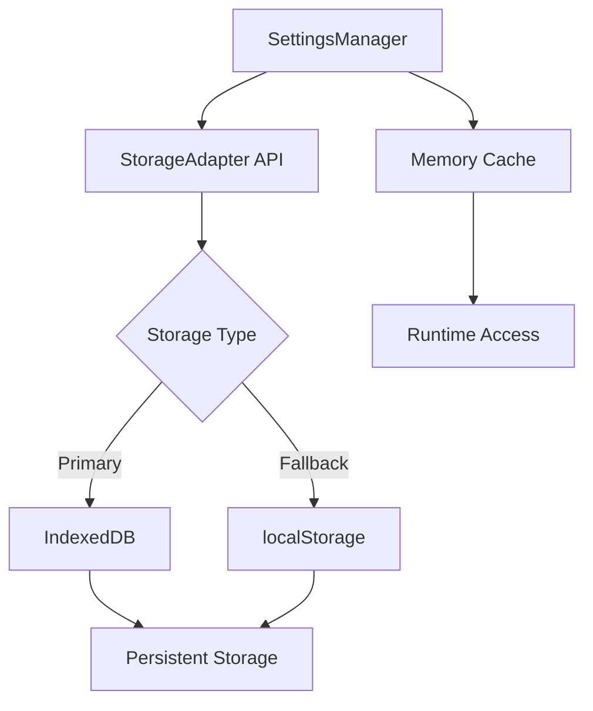

# Storage Management

Time Capsule uses a layered storage approach with IndexedDB as the primary storage mechanism, localStorage as a fallback, and an in-memory cache for performance.

## Storage Architecture



## SettingsManager Implementation

The `SettingsManager` class provides a unified interface for all configuration and state management.

### Singleton Pattern

<CodeGroup>
```typescript SettingsManager
class SettingsManager {
  private static instance: SettingsManager;
  private settings: SystemSettings;
  private readonly CURRENT_VERSION = '1.1.1';

  private constructor() {
    this.settings = this.getDefaultSettings();
    this.load();
    this.checkVersion();
  }

  public static getInstance(): SettingsManager {
    if (!SettingsManager.instance) {
      SettingsManager.instance = new SettingsManager();
    }
    return SettingsManager.instance;
  }
}

export const settingsManager = SettingsManager.getInstance();
```
</CodeGroup>

### Settings Structure

Settings are organized into logical sections:

<CodeGroup>
```typescript SystemSettings Interface
export interface SystemSettings {
  theme: {
    colors: Record<string, string>;
    fonts: Record<string, string>;
  };
  mouse: Record<string, any>;
  keyboard: Record<string, any>;
  beep: Record<string, any>;
  session: {
    windows: Record<string, {
      top: string;
      left: string;
      display: string;
      maximized: boolean;
    }>;
  };
  desktop: Record<string, any>;
}
```

```typescript Default Settings
private getDefaultSettings(): SystemSettings {
  return {
    theme: { colors: {}, fonts: {} },
    mouse: {},
    keyboard: {},
    beep: {},
    session: { windows: {} },
    desktop: {},
  };
}
```
</CodeGroup>

### Version Management

Settings are versioned to handle schema changes and cache invalidation:

<CodeGroup>
```typescript Version Check
private checkVersion(): void {
  const lastVersion = storageAdapter.getItemSync(
    `${STORAGE_KEY}-version`
  );
  
  if (lastVersion !== this.CURRENT_VERSION) {
    logger.log(
      `[SettingsManager] Version mismatch ` +
      `(${lastVersion} vs ${this.CURRENT_VERSION}). ` +
      `Resetting cache...`
    );
    this.resetToDefaults();
    storageAdapter.setItemSync(
      `${STORAGE_KEY}-version`, 
      this.CURRENT_VERSION
    );
  }
}
```
</CodeGroup>

When the version changes, all cached settings are cleared and reset to defaults. This prevents issues from schema changes.

## Storage Adapter

The `StorageAdapter` provides a unified API abstracting the underlying storage mechanism.

### Synchronous Operations

<CodeGroup>
```typescript Storage Operations
private load(): void {
  try {
    const saved = storageAdapter.getItemSync(STORAGE_KEY);
    if (saved) {
      this.settings = JSON.parse(saved);
      logger.log('[SettingsManager] Unified settings loaded.');
    } else {
      this.migrateLegacySettings();
    }
  } catch (e) {
    console.error('[SettingsManager] Failed to load:', e);
  }
}

public save(): void {
  try {
    storageAdapter.setItemSync(
      STORAGE_KEY, 
      JSON.stringify(this.settings)
    );
  } catch (e) {
    console.error('[SettingsManager] Failed to save:', e);
  }
}
```
</CodeGroup>

### Legacy Migration

Old settings stored in fragmented keys are automatically migrated:

<CodeGroup>
```typescript Migration Logic
private migrateLegacySettings(): void {
  logger.log(
    '[SettingsManager] Migrating from legacy settings...'
  );

  // Migrate Style/Theme (cde-styles)
  const oldStyles = storageAdapter.getItemSync('cde-styles');
  if (oldStyles) {
    const parsed = JSON.parse(oldStyles);
    this.settings.theme.colors = parsed.colors || {};
    this.settings.theme.fonts = parsed.fonts || {};
  }

  // Migrate Mouse
  const oldMouse = storageAdapter.getItemSync(
    'cde-mouse-settings'
  );
  if (oldMouse) {
    this.settings.mouse = JSON.parse(oldMouse);
  }

  // Migrate Keyboard
  const oldKeyboard = storageAdapter.getItemSync(
    'cde-keyboard-settings'
  );
  if (oldKeyboard) {
    this.settings.keyboard = JSON.parse(oldKeyboard);
  }

  // Migrate Beep
  const oldBeep = storageAdapter.getItemSync(
    'cde-beep-settings'
  );
  if (oldBeep) {
    this.settings.beep = JSON.parse(oldBeep);
  }

  this.save();
  logger.log('[SettingsManager] Migration completed.');
}
```
</CodeGroup>

## Section Management

Settings are accessed and updated by section:

<CodeGroup>
```typescript Section Operations
public setSection(
  section: keyof SystemSettings, 
  data: any
): void {
  (this.settings as any)[section] = data;
  this.save();
}

public getSection(section: keyof SystemSettings): any {
  return this.settings[section];
}

public getAll(): SystemSettings {
  return this.settings;
}
```

```typescript Usage Example
// Get theme settings
const theme = settingsManager.getSection('theme');
console.log(theme.colors); // { '--window-color': '#4d648d', ... }

// Update mouse settings
settingsManager.setSection('mouse', {
  acceleration: 1.5,
  doubleClickSpeed: 300
});

// Get all settings
const allSettings = settingsManager.getAll();
```
</CodeGroup>

## Window Session Persistence

Window positions and states are automatically saved:

<CodeGroup>
```typescript Window Session
public updateWindowSession(id: string, data: any): void {
  this.settings.session.windows[id] = {
    ...this.settings.session.windows[id],
    ...data
  };
  this.save();
}
```

```typescript Window Manager Integration
// Save position after drag
settingsManager.updateWindowSession(el.id, {
  left: el.style.left,
  top: el.style.top,
  maximized: el.classList.contains('maximized'),
});

// Restore on registration
const session = settingsManager.getSection('session').windows[id];
if (session && session.left && session.top) {
  win.style.left = session.left;
  win.style.top = session.top;
  if (session.maximized) {
    win.classList.add('maximized');
  }
}
```
</CodeGroup>

## IndexedDB Usage

While `SettingsManager` currently uses synchronous localStorage operations via the adapter, the architecture supports IndexedDB for future enhancements.

### Planned IndexedDB Schema

<CodeGroup>
```typescript Database Structure
const DB_NAME = 'cde-time-capsule';
const DB_VERSION = 1;

const STORES = {
  SETTINGS: 'settings',    // User preferences
  SESSION: 'session',      // Window state
  FILESYSTEM: 'filesystem', // VFS data (future)
  CACHE: 'cache',          // Temporary data
};
```

```typescript Store Schema
// Settings Store
{
  'cde-system-settings': {
    theme: { colors: {...}, fonts: {...} },
    mouse: {...},
    keyboard: {...},
    // ...
  }
}

// Cache Store with TTL
{
  'xpm-render-Afternoon': {
    data: 'data:image/png;base64,...',
    timestamp: 1234567890,
    ttl: 604800000 // 7 days
  }
}
```
</CodeGroup>

## Cache Management

### Memory Cache

SettingsManager maintains an in-memory cache for fast access:

<CodeGroup>
```typescript Cache Strategy
class SettingsManager {
  private settings: SystemSettings; // Memory cache

  // Direct memory access (fast)
  public getSection(section: keyof SystemSettings): any {
    return this.settings[section];
  }

  // Write to memory + storage
  public setSection(section: keyof SystemSettings, data: any): void {
    this.settings[section] = data; // Update cache
    this.save();                    // Persist to storage
  }
}
```
</CodeGroup>

### XPM Backdrop Cache

Rendered backdrop images are cached to avoid re-parsing expensive XPM files:

<CodeGroup>
```typescript Backdrop Caching
// Clear cache when theme colors change
public saveColor(): void {
  const theme = settingsManager.getSection('theme');
  theme.colors = this.theme.styles;
  settingsManager.setSection('theme', theme);
  
  // Invalidate XPM cache
  this.backdrop.clearCache();
  this.backdrop.apply();
}
```
</CodeGroup>

## Performance Considerations

### Synchronous Operations

SettingsManager uses synchronous localStorage operations for simplicity and reliability:

<Tip>
Synchronous storage operations are acceptable here because:
1. Settings data is small (typically < 50KB)
2. Operations are infrequent (user actions only)
3. Blocking UI briefly is better than race conditions
4. localStorage is much faster than IndexedDB for small data
</Tip>

### Batched Updates

Avoid calling `save()` in tight loops:

<CodeGroup>
```typescript Bad Practice
// DON'T: Save on every value change
for (const [key, value] of Object.entries(colors)) {
  settings.theme.colors[key] = value;
  settingsManager.save(); // ❌ Multiple disk writes
}
```

```typescript Good Practice
// DO: Batch updates then save once
for (const [key, value] of Object.entries(colors)) {
  settings.theme.colors[key] = value;
}
settingsManager.save(); // ✅ Single disk write
```
</CodeGroup>

### Selective Section Updates

Only update the section that changed:

<CodeGroup>
```typescript Efficient Updates
// Get section reference
const theme = settingsManager.getSection('theme');

// Modify section
theme.colors['--window-color'] = '#4d648d';

// Save entire settings (includes updated theme)
settingsManager.setSection('theme', theme);
```
</CodeGroup>

## Error Handling

Graceful degradation ensures the application continues working even if storage fails:

<CodeGroup>
```typescript Error Handling
private load(): void {
  try {
    const saved = storageAdapter.getItemSync(STORAGE_KEY);
    if (saved) {
      this.settings = JSON.parse(saved);
    }
  } catch (e) {
    console.error('[SettingsManager] Load failed:', e);
    // Continue with default settings
  }
}

public save(): void {
  try {
    storageAdapter.setItemSync(
      STORAGE_KEY,
      JSON.stringify(this.settings)
    );
  } catch (e) {
    console.error('[SettingsManager] Save failed:', e);
    // User changes will be lost on refresh, but app continues
  }
}
```
</CodeGroup>

## Storage Quota

### Check Available Space

<CodeGroup>
```typescript Storage Estimate
async function getStorageEstimate() {
  if ('storage' in navigator && 
      'estimate' in navigator.storage) {
    const estimate = await navigator.storage.estimate();
    return {
      usage: estimate.usage || 0,
      quota: estimate.quota || 0,
      percentage: (
        (estimate.usage || 0) / (estimate.quota || 1)
      ) * 100
    };
  }
  return null;
}
```
</CodeGroup>

### Handle Quota Exceeded

<CodeGroup>
```typescript Quota Management
try {
  storageAdapter.setItemSync(key, value);
} catch (error) {
  if (error.name === 'QuotaExceededError') {
    // Clear old cache entries
    console.warn('Storage quota exceeded, clearing cache');
    // Implement cache cleanup strategy
  }
}
```
</CodeGroup>

## Best Practices

<AccordionGroup>
  <Accordion title="Use Section-Based Access">
    Always access settings by section rather than modifying the entire settings object:
    
    ```typescript
    // Good
    const theme = settingsManager.getSection('theme');
    theme.colors['--window-color'] = '#4d648d';
    settingsManager.setSection('theme', theme);
    
    // Bad
    const all = settingsManager.getAll();
    all.theme.colors['--window-color'] = '#4d648d';
    // No automatic save!
    ```
  </Accordion>
  
  <Accordion title="Batch Related Changes">
    Group related setting changes together:
    
    ```typescript
    const theme = settingsManager.getSection('theme');
    theme.colors['--window-color'] = '#4d648d';
    theme.colors['--topbar-color'] = '#4d648d';
    theme.colors['--titlebar-color'] = '#faad49';
    settingsManager.setSection('theme', theme);
    ```
  </Accordion>
  
  <Accordion title="Handle Missing Sections Gracefully">
    Always provide defaults for potentially missing data:
    
    ```typescript
    const theme = settingsManager.getSection('theme');
    const colors = theme?.colors || {};
    const windowColor = colors['--window-color'] || '#4d648d';
    ```
  </Accordion>
  
  <Accordion title="Version Your Schema">
    When making breaking changes to settings structure, increment the version:
    
    ```typescript
    private readonly CURRENT_VERSION = '1.2.0'; // Changed from 1.1.1
    ```
    
    This triggers automatic cache reset on next load.
  </Accordion>
</AccordionGroup>

## Testing Storage

### Manual Testing in Console

<CodeGroup>
```javascript Browser Console
// Check current settings
console.log(settingsManager.getAll());

// Modify theme colors
const theme = settingsManager.getSection('theme');
theme.colors['--window-color'] = '#ff0000';
settingsManager.setSection('theme', theme);

// Verify persistence (refresh page and check)
location.reload();
console.log(settingsManager.getSection('theme').colors);

// Check localStorage directly
console.log(localStorage.getItem('cde-system-settings'));
```
</CodeGroup>

### Clear All Settings

<CodeGroup>
```javascript Reset to Defaults
// In browser console
localStorage.clear();
location.reload();

// Or programmatically
settingsManager.resetToDefaults();
```
</CodeGroup>

## Related Documentation

<CardGroup cols={2}>
  <Card title="Architecture" icon="sitemap" href="/technical/architecture">
    Overall system architecture and design patterns
  </Card>
  <Card title="Window Manager" icon="window-maximize" href="/technical/window-manager">
    Window session persistence and restoration
  </Card>
  <Card title="Virtual Filesystem" icon="folder-tree" href="/technical/virtual-filesystem">
    Future VFS storage integration
  </Card>
  <Card title="Development" icon="code" href="/technical/contributing">
    Build new features using SettingsManager
  </Card>
</CardGroup>
